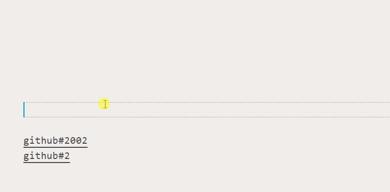

[](https://marketplace.visualstudio.com/items?itemName=usernamehw.autolink)
[](https://marketplace.visualstudio.com/items?itemName=usernamehw.autolink)
[](https://marketplace.visualstudio.com/items?itemName=usernamehw.autolink)

Match links in document with external location.

## Example

```js
"autolink.queries": [
    {
        "linkPattern": "github#(\\d{1,6})",// RegExp. Will match `github#202` text
        "linkText": "https://github.com/Microsoft/vscode/issues/${0}",// will replace `${0}` with matched group
    },
],
```




<!-- SETTINGS_START -->
## Settings (1)

|Setting|Default|Description|
|-|-|-|
|autolink.queries|\[\]|Make links from text in the document.|
<!-- SETTINGS_END -->